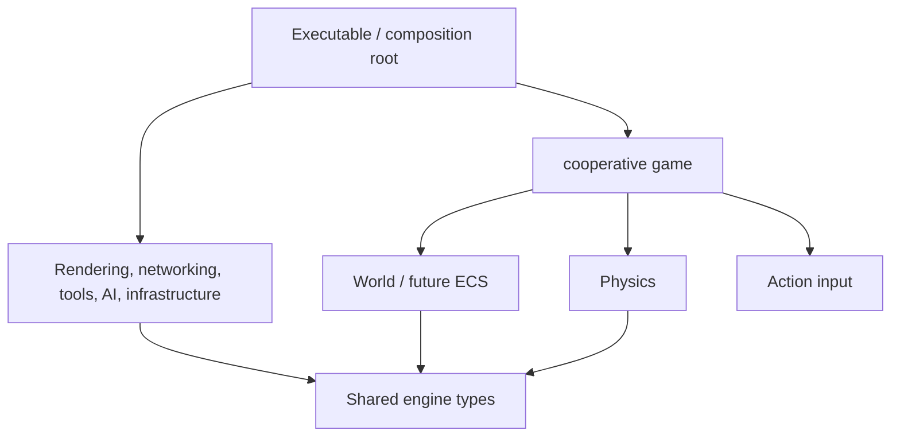

# Proposed architecture and integration contracts

These are starter contracts for team review, not a final SDD or a claim that the full engine exists. Sydney owns the ECS design; Arvin, Gunveer and Blake support architecture review.

## Dependency direction

Public engine headers never include `elemental_coop/` headers. The application connects services. Renderers receive draw commands; networking receives snapshots; neither owns game rules. The demo's validation/cache examples are illustrative and do not load a level or image. Fire/water identities, hazard rules, pressure-plate logic and shared completion belong exclusively to `elemental_coop`.

## Current shared contracts

| Area | Contract | Owner / consumer |
|---|---|---|
| Coordinates | Pixels, +x right, +y down; seconds for dt; velocities pixels/second | Physics, rendering, gameplay |
| Entity identity | Unsigned 64-bit ID, zero invalid, no reuse in starter; remote ID mapping TBD | Sydney / Henry |
| World lifetime | Game owns World; `find` borrows a pointer until entity deletion or world destruction; missing ID returns null | Sydney / all owners |
| Input | One buffer per player; held movement persists, jump/quit pulses clear after consumption; OS codes stay in the adapter | Rohan / Blake |
| Movement | Semi-implicit Euler; dt must be finite and nonnegative; initial body values supplied by caller | D'Artagnan / Blake |
| Collision | AABB overlap excludes touching edges; no response/events yet | D'Artagnan / Blake |
| Drawing | Renderer borrows commands during `draw`; recording backend copies them | Aryaman / application |
| Network | In-memory snapshot of tick, entity and position; bounded FIFO double; send false means queue full | Henry / application |
| AI | Position and patrol bounds in, persistent left/right direction out; optional hazard/NPC adapter | Rocco / Blake |
| Levels | Versioned neutral spawn document; validation returns error strings; no import/save yet | Gunveer / Arvin |
| Resources | Per-type cache, caller-supplied canonical string keys, injected loader, shared ownership | Arvin / Aryaman, Rohan |
| Errors | Invalid arguments throw; absent lookup/poll returns null/optional; load failure throws and is not cached | All owners |

All starter services are single-threaded. No global singleton or owning raw pointer is introduced. References, pointers, spans and string_views are borrowed. Owners must not let borrowed references outlive their objects. `ResourceCache::clear()` drops cache ownership but cannot invalidate external shared handles. Loader exceptions propagate; callers decide whether a resource is required or may use a fallback.

## Proposed SDL ownership (not yet implemented)

The composition root should own the platform lifetime, rendering backend and services in an explicit order. Rendering owns window/renderer handles through RAII. Resource loaders use matching SDL destruction functions. On shutdown: stop use of assets, destroy scenes and draw commands holding handles, release all asset handles and clear caches, then destroy renderer/window, then shut down SDL. Clearing a cache alone is insufficient if an external texture handle remains alive. Keep SDL resource operations on the main thread until a supported threading policy is agreed.

Rohan and Aryaman must select **one** event-polling owner; events are forwarded to tools and action mapping. Gunveer must coordinate UI capture so editor input does not accidentally trigger gameplay.

## Update order

The demo calls a fixed 1/60-second tick 120 times for two characters, without a real-time accumulator. It resolves only a temporary flat floor; a real platform solver remains D'Artagnan's task. Proposed application loop: poll OS/network events, buffer actions, consume actions and update AI/gameplay, integrate physics, resolve contacts/game rules, capture authoritative snapshots, then render and draw tools. SDL timing, collision events, packet authority, and the accumulator remain tasks; do not assume the demo implements them.

Network protocol work must define explicit field encoding, byte order, bounds, protocol version, ownership, stale-packet policy and ID mapping. Never transmit the memory representation of `StateSnapshot`.

## First integration milestone

Rohan input → Blake action handling → D'Artagnan movement → Sydney transform → Aryaman draw command. The automated integration suite covers this route for both independent players using recording-renderer and loopback doubles. Patrol AI has its own unit suite and is optional for the game. Next replace rendering/input with SDL adapters for both players; independently prove two real processes can connect before expanding gameplay. Real transport tests remain separate from loopback checks.

## Two-player game boundary

`PlayerInputs` is an array of two action frames. Slots are stable: 0 is fire, 1 is water. Each frame has held `move_x` and one-shot `primary_pressed` (jump) / `quit_requested`. `Game` owns both player entities and body state; the public world is read-only. Invalid input is rejected before either player moves. Restart retains both entity IDs and resets motion, life and exit state; future puzzle components must also reset.

After each positive-duration tick, a future collision adapter must report hazards first, then both matching-exit contacts. Tick clears exit contacts; reporting both prevents an old contact from winning a later frame. Loss and win stop movement until restart; either player can request quit. The hazard/exit functions are manual integration seams, not automatic collision detection. Elemental rules and tuning remain reviewable examples.

`StateSnapshot` still represents only one entity position. Send one per player for starter tests. It is insufficient for a complete cooperative session: Henry must add player-slot ownership, round generation, velocities, death/grounded flags, puzzle object states and agreed win/restart authority before actual networking. No wire protocol is selected here.
